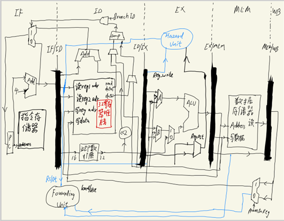
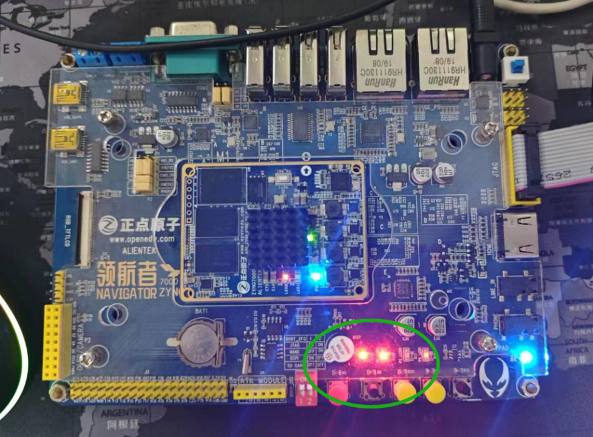
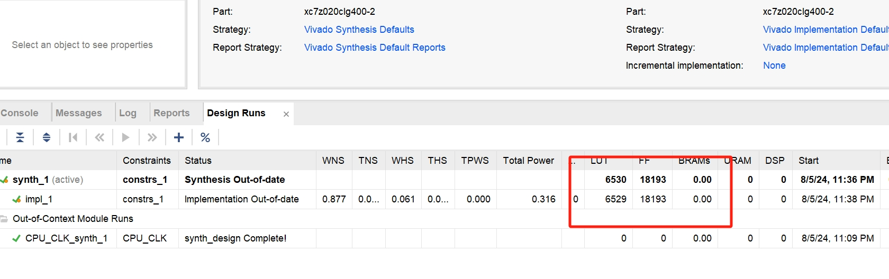
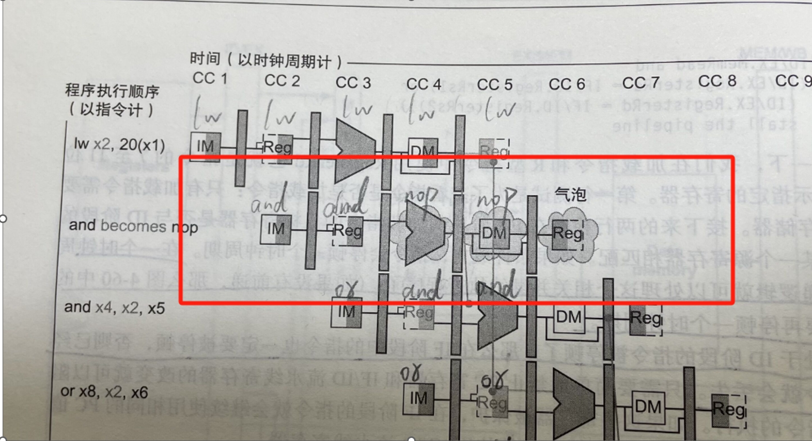

# Simple-pipeline-CPU

**参考的书籍名字叫《计算机组成与设计——硬件软件接口》(世界级经典书籍，强推！)** 
**B站这个总结课讲的也不错：https://www.bilibili.com/video/BV1Ba4y1V7GD/?spm_id_from=333.788&vd_source=31d09444083e851f8f061fab6ba0bab0**

应对当时研一时候的课程期末考核，两个人用三周多的时间，本人负责逻辑开发，队友负责机器码指令的初始化，实现的一个支持29条MIPS基础指令集的简易五级流水线CPU，在领航者7020的FPGA开发板上，100M时钟下经过验证（以暴力匹配算法为例，没有用高级语言，省去了编译，汇编的步骤，直接把汇编语言转换成机器语言在FPGA上运行）；分为取指，译码，执行，访存和写回五个流水线，原本分支跳转指令需要到EX阶段ALU计算结果出来才能判断是不是要跳转，这里为了缩短分支延迟，把分支跳转阶段移到了ID译码阶段完成，此代码可在指定开发板上直接运行，想移植欢迎咨询我。 

设计CPU的框图在下面，原理也在对应的书中，这里就不详细解释了，是从单周期CPU修改过来的，单周期CPU能跑的频率肯定不高。主要改成流水线之后，频率更高，但是也引入了设计冒险，比如load指令和Branch指令的冒险，R型指令和load指令的冒险，R型指令和R型指令之间存在的冒险，下文有解释和介绍。
由于时间短，同时要帮老师干活，人数也有限，实现的功能不那么复杂，**暂时没有加入乱序发射模块，多级缓存cache，分支预测**等模块，还有一部分原因如下：
1)	由于流水线也才5级，加上分支跳转阶段提前到了ID阶段，即便有所谓的分支错误或者假设不发生也只需要冲刷掉一条指令，这并不会有太大的消耗，如果是现代处理器，流水线深度很深的话，那么合适的分支预测是必要的！
2)	这个CPU采用的是哈佛结构，程序存储器和数据存储器（充当内存的角色）深度都不大，都是512个字节。在一块FPGA的开发板上，总合成reg后或者分布式RAM后布线也不会太长，内存访问的时间都是固定时钟周期，所以也没太考虑采用多级缓存cache。
接下来看一下这个CPU的框架图如下所示：

 
图1：基本框图

最终运行的结果是这样的：
CPU会执行一段代码，这段代码的功能是实现一个暴力匹配算法，在Linuxisnotunixisnotunixisnotunix中搜寻和unix单词匹配上的次数，并将次数显示在正点领航者7020的流水灯上；但是正点原子这个开发板老版本底板只有两个灯（也没数码管），另外两个灯又在核心板上，暂时用不上，所以最大的匹配长度也就0-3次。

  
图2：绿框的两个灯，上述语句有3次匹配 

 
图3：资源消耗图

 
## 支持的指令集

  LW, LB, SW, LUI, ADDI, ADDIU, ANDI, SLTI, SLTIU, BEQ, BNE, BLEZ, BGTZ, BLTZ/BGEZ, J, JAL, ADD, SUB, AND, OR, XOR, NOR, SLL, SRL, SRA, SLT, SLTU, JR, JALR
  
## 解决的冒险问题

这里提示一下CPU中注意的几个冒险，其它自己看代码吧，有注释。 

### R型数据冒险

首先来看一般的数据集冒险：上一条指令计算的结果下一条指令要用，把ALU模块的结果往前递一下，叫做旁路法，加入旁路模块，旁路一般分为两种：ALU-ALU旁路与MEM-ALU旁路。例如下面这个指令：add和add的R型指令冒险,$2寄存器就产生了冒险：

Sub $2,$1,$3; 
And $12,$2,$5; 
Or $13,$6,$2 
 

当前指令要用的数据来自于上一个指令的写回寄存器堆栈结果；一个是从EX/MEM阶段取出来给下一个的EX阶段，一个是从MEM/WB阶段取出来，给下下个指令的EX阶段。上一条指令优先级较高。用在ALU_forward模块，ALU有5类来源，前一条的EX/MEM,上上条指令的MEM/WB，本指令ID/EXE，还有移位或者需要操作的立即数。

### load_use冒险和R型分支冒险

这两个冒险解决办法类似，需要阻塞一个周期同时旁路。 
第一种情况Branch指令的前一条指令是R型指令型指令
在这种情况下，需要对分支指令插入一个空周期，同时需要将R或者I型指令的运算结果在ALU阶段取出来，通过旁路电路送到Branch指令的ID阶段进行运算。
 
第二种是R型指令前面是一条访存指令load use冒险。
把对应的指令直接清0，表示nop，不产生影响。如下图所示：
 

  
  图4：插入空周期示意图

  

总结：用hold信号保持IF/ID指令不会变化（同时PC不变），然后对ID/EX的寄存器全部清0,这是load use冒险；第二种情况就是先是一条R型或者I型指令（不是Load），下一条指令是brach；这种情况也是需要一个nop周期。以上两种情况需要hold_IFID，flush_IDEX两个信号协同控制。 

### load_brach型冒险

Branch指令的前一条指令访存指令，比如lb或者lw指令，这样的情况下，在MEM阶段之后才能取得对应的数据，这就需要对Branch指令往后插入两个气泡周期。怎么实现两个周期nop呢，首先要把IF/ID里面的指令和ID/EX里面的指令和控制信号清0；
然后把对应的PC指令后退4位（已经确定当前指令是Brach指令，所以直接回退就好了），可以画个时序图就明白了，假设12是load，16是branch，一看就知道，配合If/ID和ID/EX的冲刷指令一起生效。

## 一些其它细节

### 关于PC寻址问题 

关于下面PC寻址，可以设计一个选择器即可，分别对应的是，两层空气泡PC-4寻址，一层气泡延迟一时钟PC不变寻址，伪指令跳转（j和jal采用的伪直接寻址）,寄存器里面的地址（jalr和jr寄存器寻址）,分支指令立即数跳转地址(满足跳，不满足不跳回正常+4)和正常+4地址
 
下面对应汇编代码的beq，bne、blez、bgtz、bltz等判断分支指令，当经过ID译码阶段后的Branch_ID满足分支跳转，且跳转条件zero满足时，下一条指令采用PC相对寻址（I型指令）的方式从指令存储器取出来。
 
### 关于写回寄存器问题 

将运算结果写进那个寄存器，rt？rd对应32个寄存器中的哪一个，或者写进第32个ra寄存器。 
 
JOp 信号识别跳转指令，包括 J, JAL, JR, 和 JALR（无条件跳转，取下一条指令的地址）。
Branch 信号识别分支指令，包括 BEQ, BNE, BLEZ, BGTZ, BGEZ, 和 BLTZ。
Extop当且仅当是andi指令，需要扩展0位，其它指令都是扩展立即数最高位符号位。
ImmExtout当且仅当是LUI指令时,在立即数低位扩展16个0输出，其它都是符号位扩展成32位或者补0扩展成32位。
 
ImmExtShift_ID指令：这是PC相对寻址，用于字节寻址（一个指令一个字，占4个字节），先*4，计算跳转指令的位置；

### 关于写回寄存器堆的数据选择 

MEMtoreg最终是MemtoReg_WB的选择信号，当他是1的时候，是写回控制信号，控制写回的数据WB，如果是1，写回内存读的信号，lb或者lw指令；如果是2的话是jal和jalr指令，要把PC对应的计数器存入ra制定寄存器；其他的就是运算指令的结果。
 
Jal是跳转到指定的目标地址 target，用的伪直接寻址；
Jalr跳转到寄存器中制定的目标，并将返回地址写进$ra或者指定寄存器。
完结！

